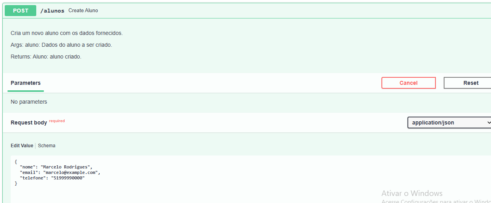
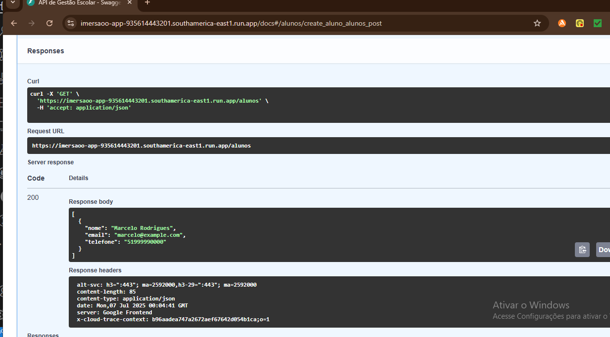
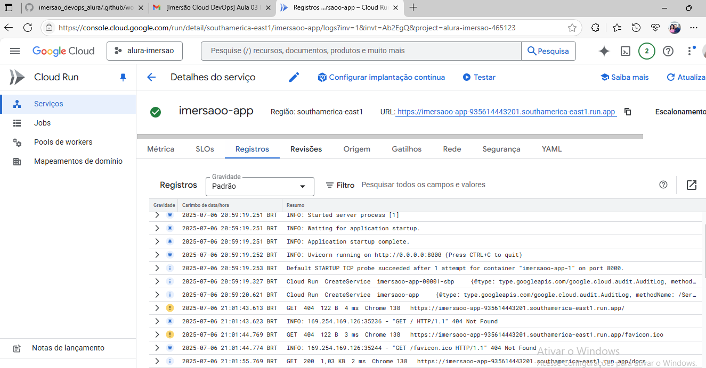

# 🚀 Imersão DevOps - Alura Google Cloud


Este projeto é uma API desenvolvida com **FastAPI** para gerenciar **alunos, cursos e matrículas** de uma instituição de ensino.

---

## ✅ Execução realizada por mim

Abaixo estão os registros que comprovam a execução e deploy pessoal do projeto:

### 1️⃣ Autenticação no Google Cloud e ativação de APIs


### 2️⃣ Commit e push do projeto para o GitHub


### 3️⃣ Deploy da API via Cloud Run


---

## 🎥 Demonstração da API

> *Você pode adicionar um gif com a API rodando localmente ou sendo acessada via `/docs`*


---

## ⚙️ Pré-requisitos

- [Python 3.10+](https://www.python.org/downloads/)
- [Git](https://git-scm.com/)
- [Docker](https://www.docker.com/)

---

## 🛠️ Executando o projeto localmente

```bash
# Criar ambiente virtual
python3 -m venv venv

# Ativar ambiente virtual
source venv/bin/activate  # Linux/macOS
venv\Scripts\activate     # Windows

# Instalar dependências
pip install -r requirements.txt

# Executar aplicação
uvicorn app:app --reload
Acesse a documentação interativa: 👉 

````
---

## 🚀 Deploy na Nuvem (Google Cloud)
````bash
gcloud auth login
gcloud config set project alura-imersao-465123
gcloud run deploy --port=8000
````
---

## 🌐 API publicada
A API está hospedada via Google Cloud Run: 
🔗 https://imersao-app-935614443201.southamerica-east1.run.app

---

## 🔎 Exemplo de resposta do endpoint /alunos
````json
[
  {
    "nome": "Marcelo Rodrigues",
    "email": "marcelo@example.com",
    "telefone": "51999990000"
  }
]
````
---

## 📁 Estrutura do Projeto
````css
imersao-devops-main/
├── app.py
├── database.py
├── models.py
├── routers/
│   ├── alunos.py
│   ├── cursos.py
│   └── matriculas.py
├── schemas.py
├── escola.db
├── Dockerfile
├── requirements.txt
├── .gitignore
├── .dockerignore
├── imgs_ex/
│   ├── imersao_ex1.PNG
│   ├── imersao_ex2.PNG
│   ├── imersao_ex3.PNG
│   ├── imersao_ex4.PNG
│   └── demo.gif
└── README.md
````
---
## 📄 Licença
Este projeto está sob a licença MIT.